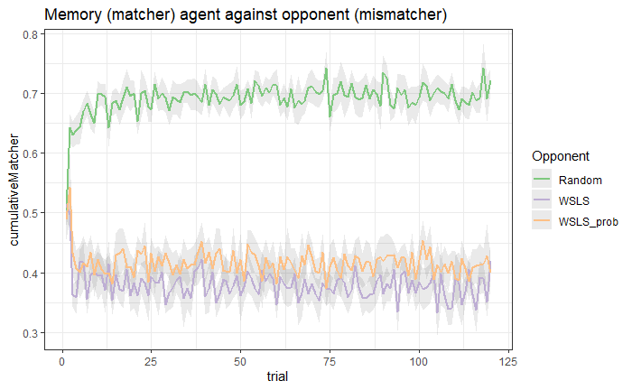

# Advanced Cognitive Modeling - Spring 2022
Repository for the course Advanced Cognitive Modeling as part of the masters degree in [Cognitive Science](https://eddiprod.au.dk/EDDI/webservices/DokOrdningService.cfc?method=visGodkendtOrdning&dokOrdningId=14811&sprog=en) at Aarhus University

## Assignments
The code for the Assignments will be in the folder ``assignments/``. The folder includes the following assignments
| Asignment | Description | Submission |
|-----|----------|------------|
| 1 | Describe and motivate one possible verbal model of how the Matching Pennies Task is solved and provide an algorithmic formalization (in R). | W4 |
| 2 | Analyze the data produced by your study group (or only you if without a study group) in the Matching Pennies Game. Produce a written report of the analyses. | W8 |
| 3 | Apply a weighted bayes model to a new task: social conformity. | W10 |
| 4 | Apply a reinforcement learning model (Rescorla-Wagner is recommended) to one of the datasets shared in class and evaluate the model. | W13 |
| 5 [?] | Choose a model (e.g. from HbayesDM or my recoding of the Lee and Wagnmakers models) and use the Bayesian workflow to assess parameter recovery and identify optimal experimental design. | After W13 |

### Assignment 1:
See folder ```assignments/a1```
For the text, accompanying the assignment, see description in [the google docs](https://docs.google.com/document/d/1zb-AtV45-vx2DGHeZ7ZWjA_5C7Qsavs6SuY2_GykeuI/edit)


### Assignment 2:

### Assignment 3:

### Assignment 4:

### Assignment 5:
