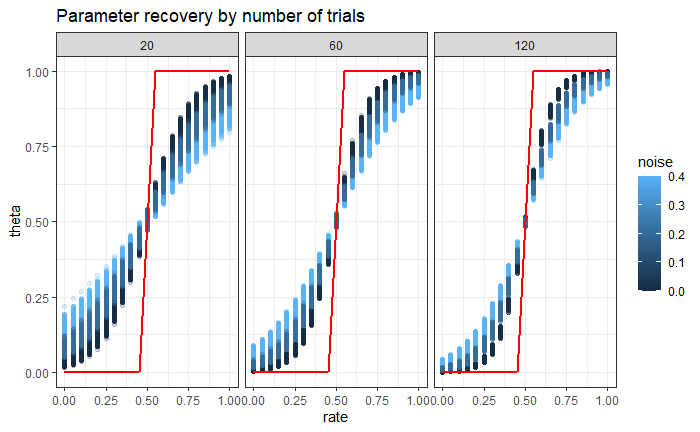
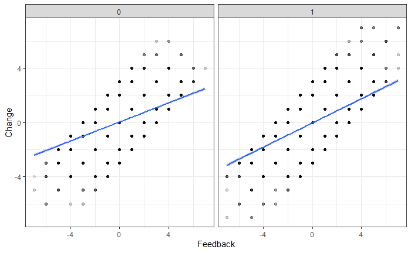

# Advanced Cognitive Modeling - Spring 2022
Repository for the course Advanced Cognitive Modeling as part of the masters degree in [Cognitive Science](https://eddiprod.au.dk/EDDI/webservices/DokOrdningService.cfc?method=visGodkendtOrdning&dokOrdningId=14811&sprog=en) at Aarhus University

## Assignments
The code for the Assignments will be in the folder ``assignments/``. The folder includes the following assignments
| Asignment | Description | Submission |
|-----|----------|------------|
| 1 | Describe and motivate one possible verbal model of how the Matching Pennies Task is solved and provide an algorithmic formalization (in R). | W4 |
| 2 | Analyze the data produced by your study group (or only you if without a study group) in the Matching Pennies Game. Produce a written report of the analyses. | W8 |
| 3 | Apply a simple bayes and a weighted bayes model to a new task: social conformity. | W10 |
| 4 | Apply a reinforcement learning model (Rescorla-Wagner is recommended) to simulated data. Identify the number of trials needed to recover parameters. | W12 |
| 5 | Reflect on our learning process throughout the course | After W12 |

### Assignment 1:
See folder ```assignments/a1```.
For the text, accompanying the assignment, see description in [the google docs](https://docs.google.com/document/d/1zb-AtV45-vx2DGHeZ7ZWjA_5C7Qsavs6SuY2_GykeuI/edit)
.

### Assignment 2:
See folder ```assignments/a2```.
For the text, accompanying the assignment, see description in [the google docs](https://docs.google.com/document/d/1uGExV1nhm-FP5QGTHoyG3bA-oj1253n0vUR04Z1nc28/edit#heading=h.dxsscth36fui).


### Assignment 3:
See folder ```assignments/a3```.
For the text, accompanying the assignment, see description in [the google docs](https://docs.google.com/document/d/1ab_LKP8O2EaGfPfGugPH00LyCcf3N6tSL6IM2p4vj-w/edit).


### Assignment 4:
See folder ```assignments/a4```.
For the text, accompanying the assignment, see description in [the google docs](https://docs.google.com/document/d/1j4ZhBgyHOVTARA4uSQwQ5qawJG1r1xR40Pr-ly-hLGY/edit).


### Assignment 5:
The reflection is in [the google docs](https://docs.google.com/document/d/1mwMT34dkK0EjKFlavax09HF9UIDVFRj9M4PsJy_6A7g/edit#).

